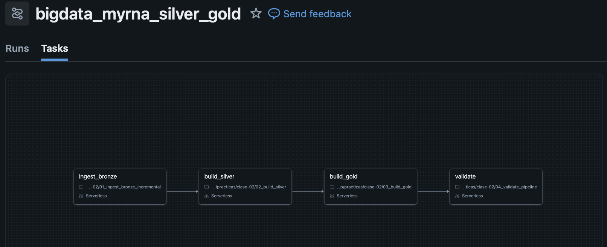
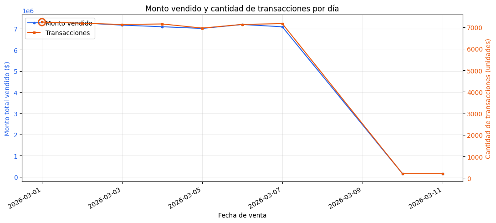
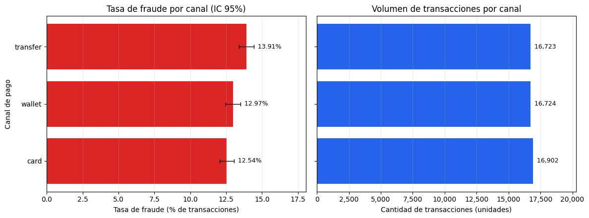
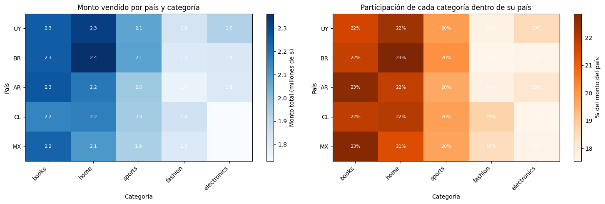
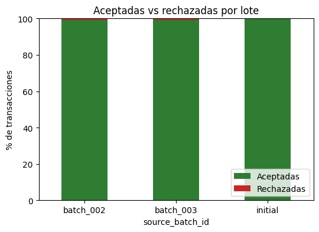

# Myrna Oskierko - id: myrna

## DAG


### Nombre del JOB
bigdata_myrna_silver_gold

## Validaciones de los runs

| job_run_id | expected_batch_id | silver_rows | quarantine_rows | gold_rows | gold_total_amount | recorded_at | idempotence_compared |
|---|---|---|---|---|---|---|---|
| 889995353496317 | batch_003 | 50349 | 55 | 669 | 50431198.33 | 2026-10-03T12:58:22.171+00:00 | false |
| 1100180262900947 | batch_002 | 50149 | 53 | 598 | 50286183.33 | 2026-10-03T12:51:28.908+00:00 | true |
| 581853062379729 | batch_002 | 50149 | 53 | 598 | 50286183.33 | 2026-10-03T12:48:21.190+00:00 | false |

## Cantidades aceptadas y rechazadas para `batch_002` (primer run)

| source_batch_id | accepted_transactions | rejected_transactions | total_amount | fraud_transactions | refreshed_at |
|---|---|---|---|---|---|
| batch_002 | 201 | 2 | 146812.99 | 28 | 2026-10-03T12:47:54.413+00:00 |
| initial | 49948 | 51 | 50139370.34 | 6560 | 2026-10-03T12:47:54.413+00:00 |

### Motivos de rechazo
| source_batch_id | quality_reason | count |
| --- | --- | --- |
| batch_002 | INVALID_AMOUNT | 1 |
| batch_002	| UNKNOWN_CUSTOMER | 1 |

## Diferencias entre `COPY INTO` y `MERGE`
### COPY INTO
Carga archivos desde el origen a una tabla, llevado un registro de lo que cargó, por lo que no duplica archivos.
No analiza el contenido, por lo que si un mismo `id` llega en dos archivos distintos, el contenido se duplica.

### MERGE
Compara el origen contra el destino por claves para operaciones de inserción y actualización.
Hace deduplicación por clave, por lo que si se reprocesa un mismo archivo y la lógica es la correcta, no genera duplicados.

## Granularidad de tablas GOLD

`gold_daily_sales`: por día (GROUP BY to_date(t.event_ts)).

`gold_customer_risk`: por cliente (GROUP BY t.customer_id).

# Visualizaciones
## Evolución temporal
¿Qué día tuvo el mayor monto vendido y ese día también fue el de mayor cantidad de transacciones?
### Gráfico

### Respuesta
Día de mayor monto: 2026-03-01 ($7,310,840.77, 7,236 transacciones, ticket promedio $1,010.34).

Día de más transacciones: 2026-03-01 (7,236 transacciones, ticket promedio $1,010.34).

Ambos máximos coinciden. El día de mayor monto también fue el de más transacciones, por lo que el récord de ventas se explica principalmente por mayor volumen de operaciones y no por un ticket promedio inusualmente alto.

## Canal y fraude
¿Qué canal de pago presenta la mayor tasa de fraude? ¿La conclusión se sostiene al considerar el número de transacciones de cada canal?

### Gráfico

### Respuesta
| payment_channel | transaction_count | fraud_transactions | tasa_% | IC_inf_% | IC_sup_% |
| --- | --- | --- | --- | --- | --- |
| transfer | 16723.0 | 2327.0 | 13.915 | 13.399 | 14.448 |
| wallet | 16724.0 | 2169.0 | 12.969 | 12.469 | 13.487 |
| card | 16902.0 | 2119.0 | 2.537 | 12.046 | 13.045 |

El canal con mayor tasa de fraude es 'transfer' (13.91% sobre 16,723 transacciones).

## Concentración geográfica y de producto
¿Qué combinación de país y categoría genera el mayor monto? ¿Existe una categoría dominante en todos los países o cambia según el mercado?

### Gráfico

### Respuesta
Mayor monto: BR - home ($2,361,959.97).

Categoría líder por país:
- UY: home (22.3% del monto del país)
- BR: home (22.9% del monto del país)
- AR: books (22.7% del monto del país)
- CL: home (22.0% del monto del país)
- MX: books (22.8% del monto del país)

No hay una categoría dominante en todos los países. El liderazgo cambia según el mercado (home, books), por lo que la mezcla de producto depende del país.

## Calidad del pipeline
¿Qué proporción de cada lote fue aceptada y rechazada? ¿El lote nuevo presenta una calidad diferente del lote inicial?

### Gráfico


### Respuesta
En todos los casos se aceptó más del 99% de las transacciones.

|source_batch_id|accepted_transactions|rejected_transactions|total|accepted_pct|rejected_pct|
|---|---|---|---|---|---|
|batch_002|200|2|202|99.01|0.99|
|batch_003|201|2|203|99.01|0.99|
|initial|49948|51|49999|99.9|0.1|

# Preguntas de análisis de tablas

### 1. ¿Cuántas filas físicas recibió cada lote en `bronze_transactions_incremental`? Escribí una consulta que muestre el resultado por `source_batch_id`.

#### Query
```
SELECT
    source_batch_id,
    COUNT(*) AS rows,
    COUNT(DISTINCT transaction_id) AS unique_rows
FROM {bronze_incremental}
GROUP BY source_batch_id
```

#### Resultado
|source_batch_id|rows|unique_rows|
|---|---|---|
|batch_002|204|203|
|batch_003|204|203|

### 2. Para cada lote, ¿cuántas transacciones fueron aceptadas y cuántas quedaron en `silver_transactions_quarantine`? Reconciliá tus resultados con `gold_batch_summary`.

#### Query
```
WITH bronze AS (
  SELECT source_batch_id, COUNT(*) AS filas_fisicas
  FROM {bronze_transactions_all} GROUP BY source_batch_id
), aceptadas AS (
  SELECT source_batch_id, COUNT(*) AS aceptadas
  FROM {silver_transactions} GROUP BY source_batch_id
), rechazadas AS (
  SELECT source_batch_id, COUNT(*) AS rechazadas
  FROM {silver_transactions_quarantine} GROUP BY source_batch_id
)
SELECT g.source_batch_id,
       b.filas_fisicas,
       COALESCE(a.aceptadas, 0)  AS aceptadas_silver,
       g.accepted_transactions   AS aceptadas_gold,
       COALESCE(r.rechazadas, 0) AS rechazadas_silver,
       g.rejected_transactions   AS rechazadas_gold,
       b.filas_fisicas - g.accepted_transactions - g.rejected_transactions AS no_explicadas,
       (COALESCE(a.aceptadas, 0) = g.accepted_transactions
        AND COALESCE(r.rechazadas, 0) = g.rejected_transactions) AS reconcilia
FROM {gold_batch_summary} g
LEFT JOIN bronze     b ON b.source_batch_id = g.source_batch_id
LEFT JOIN aceptadas  a ON a.source_batch_id = g.source_batch_id
LEFT JOIN rechazadas r ON r.source_batch_id = g.source_batch_id
ORDER BY g.source_batch_id;                   
```

### Resultado
|source_batch_id|filas_fisicas|aceptadas_silver|aceptadas_gold|rechazadas_silver|rechazadas_gold|no_explicadas|reconcilia|
|---|---|---|---|---|---|---|---|
|batch_002|204|200|200|2|2|2|true|
|batch_003|204|201|201|2|2|1|true|
|initial|50011|49948|49948|51|51|12|true|

### 3. ¿Qué motivos de rechazo aparecen en la cuarentena y cuántos registros tiene cada uno por lote? ¿Los rechazos observados coinciden con los casos introducidos por el generador?

#### Query
```
SELECT
    source_batch_id,
    quality_reason,
    COUNT(*) AS registros
FROM {silver_transactions_quarantine}
GROUP BY source_batch_id, quality_reason
ORDER BY source_batch_id, registros DESC
```

#### Resultado
|source_batch_id|quality_reason|registros|
|---|---|---|
|batch_002|UNKNOWN_CUSTOMER|1|
|batch_002|INVALID_AMOUNT|1|
|batch_003|INVALID_AMOUNT|1|
|batch_003|UNKNOWN_CUSTOMER|1|
|initial|INVALID_AMOUNT|51|

### 4. Seguí la transacción `42` desde `bronze_transactions_all` hasta `silver_transactions`. ¿Cuántas versiones existen en Bronze y cuál quedó vigente en Silver? Mostrá las columnas que justifican la elección.

#### Query
```
bronze_trx_42 = (spark.table(bronze_transactions_all)
    .where(F.trim("transaction_id") == "42")
    .select("transaction_id", "source_batch_id", "updated_at", "amount",
            "payment_channel", "is_fraud", "event_ts")
    .orderBy("updated_at"))
display(bronze_trx_42)

silver_trx_42 = (spark.table(silver_transactions)
    .where("transaction_id = 42")
    .select("transaction_id", "source_batch_id", "updated_at", "amount",
            "payment_channel", "is_fraud", "event_ts", "processed_at"))
display(silver_trx_42)
```

#### Resultados
Bronze:
|transaction_id|source_batch_id|updated_at|amount|payment_channel|is_fraud|event_ts|
|---|---|---|---|---|---|---|
|42|initial|2026-03-06 02:07:52|600.11|transfer|0|2026-03-06 02:07:52|
|42|batch_002|2026-03-10 02:00:00|1999.99|card|1|2026-03-10 00:00:00|
|42|batch_003|2026-03-11 02:00:00|1999.99|card|1|2026-03-11 00:00:00|

Silver:
|transaction_id|source_batch_id|updated_at|amount|payment_channel|is_fraud|event_ts|processed_at|
|---|---|---|---|---|---|---|---|
|42|batch_003|2026-03-11T02:00:00.000+00:00|1999.99|card|1|2026-03-11T00:00:00.000+00:00|2026-10-03T12:57:25.203+00:00|

#### Justificación
Se conserva la transacción del batch 3 por ser la más reciente (`updated_at`). Este criterio de deduplicación está en el MERGE.

### 5. Comprobá mediante una consulta que `silver_transactions` tiene una sola fila por `transaction_id`. ¿Qué resultado indicaría que la deduplicación falló?

#### Query
```
result = spark.sql(f"""
SELECT
    COUNT(*) as q_rows,
    COUNT(DISTINCT transaction_id) as unique_rows
FROM {silver_transactions}
""")
```

#### Resultados
|q_rows|unique_rows|
|---|---|
|50349|50349|

#### Respuesta
Mediante el conteo de filas totales y el conteo distinto de `transaction_id` se verifica que no hay transacciones duplicadas.
De haberlas, `unique_rows` sería menor que `q_rows`.

### 6. Calculá la tasa de rechazo de cada lote como `rechazadas / (aceptadas + rechazadas)` en `gold_batch_summary`. ¿Es correcto comparar solamente las cantidades absolutas si los lotes tienen tamaños diferentes?

#### Query
```
result = spark.sql(f"""
SELECT
    source_batch_id,
    accepted_transactions / (accepted_transactions + rejected_transactions) as accepted_ratio
FROM {gold_batch_summary}
GROUP BY 1,2
""")
```

#### Resultados
|source_batch_id|accepted_ratio|
|---|---|
|batch_002|0.9900990099009901|
|initial|0.998979979599592|
|batch_003|0.9901477832512315|

#### Respuesta
No es correcto comparar lotes de distintos tamaños con cantidades absolutas. Un lote más grande acumula más rechazos solo por tener más
ocurrencias. Usar tasas normaliza por denominador, lo que iguala a los lotes en una misma escala (0,1) y los compara por nivel de 
calidad.

### 7. ¿Qué día presenta el mayor monto total y cuál presenta la mayor cantidad de transacciones? Consultá `gold_daily_sales` y explicá si ambos máximos coinciden.

#### Query
```
result = spark.sql(f"""
WITH daily AS (
    SELECT
        sale_date,
        SUM(total_amount) AS total_amount,
        SUM(transaction_count) AS transaction_count
    FROM {gold_daily_sales}
    GROUP BY sale_date
)
SELECT
    MAX_BY(sale_date, total_amount) AS dia_mayor_monto,
    MAX(total_amount) AS mayor_monto,
    MAX_BY(sale_date, transaction_count) AS dia_mayor_transacciones,
    MAX(transaction_count) AS mayor_cantidad_transacciones,
    MAX_BY(sale_date, total_amount) = MAX_BY(sale_date, transaction_count) AS coinciden
FROM daily
""")
```

#### Resultados
|dia_mayor_monto|mayor_monto|dia_mayor_transacciones|mayor_cantidad_transacciones|coinciden|
|---|---|---|---|---|
|2026-03-01|7310840.77|2026-03-01|7236|true|

### 8. ¿Qué canal de pago tiene la mayor tasa global de fraude? Calculala como `SUM(fraud_transactions) / SUM(transaction_count)` y explicá por qué no corresponde promediar directamente `fraud_rate`.

#### Query
```
result = spark.sql(f"""
SELECT
    payment_channel,
    SUM(fraud_transactions) AS fraudes,
    SUM(transaction_count) AS transacciones,
    SUM(fraud_transactions) / NULLIF(SUM(transaction_count), 0) AS tasa_fraude_global,
    AVG(fraud_rate) AS promedio_simple_fraud_rate
FROM {gold_daily_sales}
GROUP BY payment_channel
ORDER BY tasa_fraude_global DESC
""")
```

#### Resultados
|payment_channel|fraudes|transacciones|tasa_fraude_global|promedio_simple_fraud_rate|
|---|---|---|---|---|
|transfer|2327|16723|0.1391496741015368|0.13906054|
|wallet|2169|16724|0.1296938531451806|0.12762915|
|card|2119|16902|0.12536977872441132|0.12473363|

#### Respuesta
El canal de pago con mayor tasa de fraude es `transfer`. No conviene utilizar `AVG(fraud_rate)` porque es un promedio con denominadores
distintos. Cada fila tiene un `transaction_count` distinto y la función AVG() le da el mismo peso a todas las filas, independientemente
de la cantidad de transacciones.
Por otro lado, como se puede apreciar en los resultados de la query, el promedio simple tiene una diferencia decimal de la tasa global,
producto de que `fraud_rate` está redondeado y va acarreando diferenciasd.

### 9. ¿Qué combinación de país y categoría concentra el mayor monto vendido? Mostrá también la combinación líder dentro de cada país.

#### Query
```
result = spark.sql(f"""
WITH combo AS (
    SELECT
        country,
        category,
        SUM(total_amount) AS total_amount
    FROM {gold_daily_sales}
    GROUP BY country, category
),
ranked AS (
    SELECT
        *,
        RANK() OVER (ORDER BY total_amount DESC) AS rank_global,
        RANK() OVER (PARTITION BY country ORDER BY total_amount DESC) AS rank_pais
    FROM combo
)
SELECT
    country,
    category,
    total_amount,
    rank_global = 1 AS lider_global
FROM ranked
WHERE rank_pais = 1
ORDER BY total_amount DESC
""")
```

#### Resultados
|country|category|total_amount|lider_global|
|---|---|---|---|
|BR|home|2361959.97|true|
|UY|home|2323924.46|false|
|AR|books|2267722.26|false|
|MX|books|2235941.63|false|
|CL|home|2167748.03|false|

### 10. Compará las dos primeras filas de `pipeline_run_audit` correspondientes a la reejecución de `batch_002`. ¿Qué métricas permanecen iguales y qué columna demuestra que se realizó la comparación de idempotencia?

#### Query
```
result = spark.sql(f"""
WITH runs AS (
    SELECT *,
        ROW_NUMBER() OVER (ORDER BY recorded_at) AS run_n
    FROM {pipeline_run_audit}
    WHERE expected_batch_id = 'batch_002'
)
SELECT
    COUNT(*) AS corridas,
    COUNT(DISTINCT silver_rows) = 1 AS silver_igual,
    COUNT(DISTINCT quarantine_rows) = 1 AS quarantine_igual,
    COUNT(DISTINCT gold_rows) = 1 AS gold_rows_igual,
    COUNT(DISTINCT gold_total_amount) = 1 AS gold_amount_igual,
    COUNT(DISTINCT job_run_id) = COUNT(*) AS job_run_distinto,
    MAX_BY(idempotence_compared, recorded_at) AS idempotence_compared_ultima_corrida
FROM runs
WHERE run_n <= 2
""")
```

#### Resultados
|corridas|silver_igual|quarantine_igual|gold_rows_igual|gold_amount_igual|job_run_distinto|idempotence_compared_ultima_corrida|
|---|---|---|---|---|---|---|
|2|true|true|true|true|true|true|

### 11. En `01_ingest_bronze_incremental.ipynb`, ¿qué problema resuelve `COPY INTO` y qué información utiliza para evitar cargar dos veces el mismo archivo físico?

`COPY INTO` carga los archivos de la carpeta a la tabla delta sin reprocesar los ya cargados.
Si se reejecuta o si llegan nuevos batches, no es necesario llevar un control manual de lo que ya se procesó.

Los duplicados se evitan a partir del log en la tabla destino de la ruta de cada archivo ingestado.
En cada run, la cláusula `COPY INTO` compara los archivos de la carpeta con ese registro y carga los faltantes.

Como la deduplicación es por nombre de archivo y no por contenido, si un archivo se sobreescribe conservando su ruta,
los cambios no se impactarán en la base.

### 12. ¿Por qué la vista `bronze_transactions_all` usa `UNION ALL` en lugar de eliminar duplicados? ¿En qué capa se resuelven los duplicados de negocio y por qué?

Porque `bronze` es una capa cruda e inmutable. Por definición, tiene que conservar todos los registros tal cual llegaron y
manteniendo el lote de origen para tener trazabilidad, poder auditrar y reprocesar.

Los duplicados se resuelven en la capa `silver`, donde se sanitizan los datos en general y hay aplicaciones básicas de reglas
de negocio, como la aplicación del `transacion_id` como clave. El resto de las reglas de negocio y agregaciones se aplican en la capa `gold`.


# PENDIENTES

### Interpretación del código y del pipeline


13. ¿Por qué las transacciones iniciales reciben `source_batch_id='initial'` y usan `event_ts` como `updated_at`? ¿Cómo afecta eso a la corrección de la transacción `42`?
14. En `quality_rules.py`, ¿qué ventaja ofrece `try_cast` frente a un `cast` convencional cuando llega un importe como `N/A`?
15. Las reglas de calidad asignan una única `quality_reason`. ¿Qué sucede si un registro viola más de una regla y por qué importa el orden de las condiciones?
16. Explicá cómo se construye `_record_key` y cómo se usa junto con `row_number`. ¿Qué caso cubre el hash cuando `transaction_id` no puede convertirse a un número?
17. Interpretá las dos cláusulas principales del `MERGE` de `silver_transactions`. ¿Cuándo se actualiza una fila existente y cuándo se inserta una nueva?
18. ¿Por qué las tablas Gold se reconstruyen completamente en esta práctica mientras Silver se actualiza con `MERGE`? Mencioná una ventaja y una limitación de cada estrategia.
19. ¿Por qué `expected_batch_id` no participa en la detección del archivo nuevo? Indicá qué parte del pipeline descubre `batch_003` y qué parte utiliza el parámetro.
20. Si la tarea `build_silver` falla, ¿qué ocurre con `build_gold` y `validate` en el Job? Explicá cómo las dependencias del DAG evitan publicar o validar resultados incompletos.
